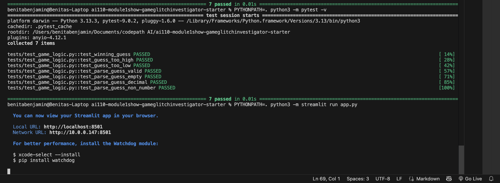
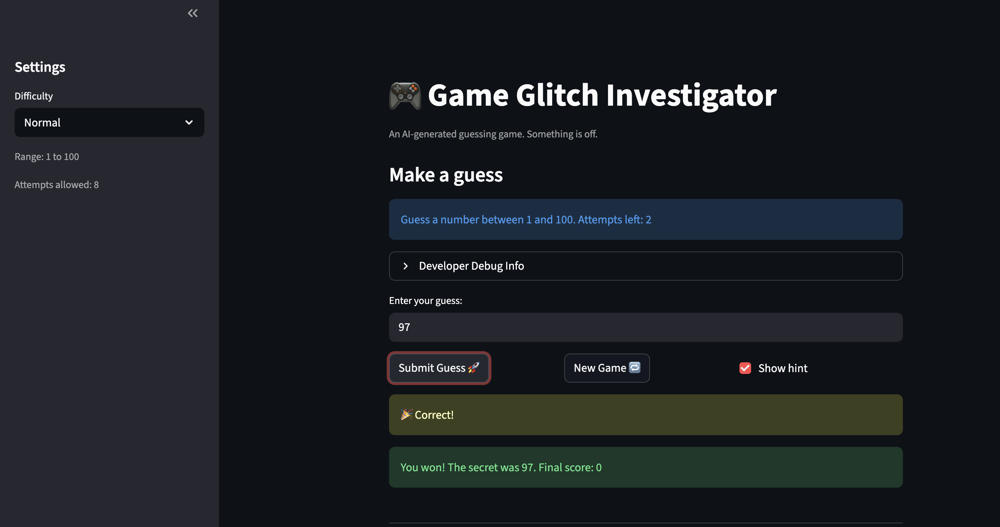

# 🎮 Game Glitch Investigator: The Impossible Guesser

## 🚨 The Situation

You asked an AI to build a simple "Number Guessing Game" using Streamlit.
It wrote the code, ran away, and now the game is unplayable. 

- You can't win.
- The hints lie to you.
- The secret number seems to have commitment issues.

## 🛠️ Setup

1. Install dependencies: `pip install -r requirements.txt`
2. Run the broken app: `python -m streamlit run app.py`

## 🕵️‍♂️ Your Mission

1. **Play the game.** Open the "Developer Debug Info" tab in the app to see the secret number. Try to win.
2. **Find the State Bug.** Why does the secret number change every time you click "Submit"? Ask ChatGPT: *"How do I keep a variable from resetting in Streamlit when I click a button?"*
3. **Fix the Logic.** The hints ("Higher/Lower") are wrong. Fix them.
4. **Refactor & Test.** - Move the logic into `logic_utils.py`.
   - Run `pytest` in your terminal.
   - Keep fixing until all tests pass!

## 📝 Document Your Experience

- [ ] Describe the game's purpose

The purpose of the game is to guess a secret number within a limited number of attempts. 
- [ ] Detail which bugs you found.

- Secret number wasn't constant for each game
- Guess allowed out of range numbers
- Guess accepted non int 
- Hints were wrong

MORE DETAILED BUG FIXES 

1. Secret number changing
Bug: Every time the app reran, the secret number reset
Fix: Stored secret in st.session_state and only generated a new secret when starting a new game or changing difficulty

2. Parse Guess allowed out of range 
Bug: User could enter a number outside the range, and the game would accept it
Fix: Added low and high parameters and checked that value is within that range

3. Check guess validation
Bug: If guess or secret were not integers, the game could crash.
Fix: Cast both guess and secret to integers

4. Hints were wrong
Bug: The “Too High” / “Too Low” hints behaved inconsistently
Fix: Added type-safety by converting and made sure check_guess always returns a tuple

- [ ] Explain what fixes you applied.
- Moved the secret number into st.session_state
- Added checks to accept numbers which are in given state
- Changed hints correctly

## 📸 Demo

- [ ] [Insert a screenshot of your fixed, winning game here]

## 🚀 Stretch Features

- [ ] [If you choose to complete Challenge 4, insert a screenshot of your Enhanced Game UI here]
